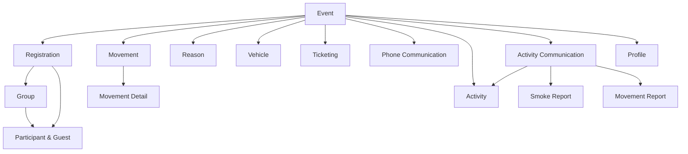
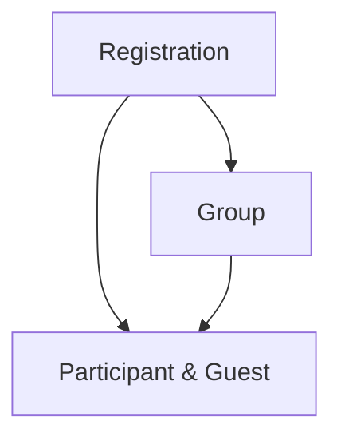

---
layout:
  title:
    visible: true
  description:
    visible: false
  tableOfContents:
    visible: true
  outline:
    visible: true
  pagination:
    visible: true
---

# 👩‍🏫 Profile 🔵

## Definition

Cf. [Glossary](../../../../../../Perso/registry-documentation/glossary.md)

### Properties

* **User**\
  The User's Profile (Required if Structure is empty)
* **Structure**\
  This Structure's Profile (Required if User is empty)
* **Role**\
  The related Role
* **Start access date and time**\
  Profile can has duration limit, this field is the date and time of the access beginning.
* **End access date and time**\
  Profile can has duration limit, this field is the date and time of the access ending.
* **Event**\
  The Event concerned by the Role scope
* **Registration**\
  The Registration concerned by the Role scope
* **Hidden**\
  A Profile can be block and unblock.

## Profile's Scope

Depending on the type of Profile (Event or Registration), the Role's scope of application is different.

### Event

If a Profile concerns an Event, it's a single Event, not all Events.

### Registration

If a Profile concerns a Registration, it is a single Registration and not all Registrations.

## Features

### As a User

* I can consult my Profiles (with search, sort, etc.).
* I can create a Support Profile (1h of access).
* I can invite Users to Events (it mean Profile creation).
* I can invite Structures to Events (it mean Profile creation).
* I can block (hide) Profiles.
* I can unblock (restore) Profiles.
* I can delete Profiles.

## Constraints

### As a User

* My Profiles are the list of mine and my Structures' Profiles.
* I can sort Profiles by linked User's last name or Structure's name.
* I can search Profile by User, Structure or Event properties.
* I can access to my Profiles when
    * Start access is null, now or in the past
    * End access is null, now or in the future
    * It is not hidden
* I can hide a specific User in a Structure Profile
* I can only invite Users or Structures to an Event if I already have a Profile.
* I can create several profiles at once to avoid unpleasant gestures (Multiple Users invitation)
* I cannot create or edit a Profile with End access date and time before or equal Start access date and time


Bear in mind that this type of data is often created all at once (or at least a lot at once). The UX must be geared to
this context.\

That's why: "I can create several profiles at once to avoid unpleasant gestures"


### Other

* When a Structure and a User have a Profile for the same Event or Registration, then the User's profile prevails.
