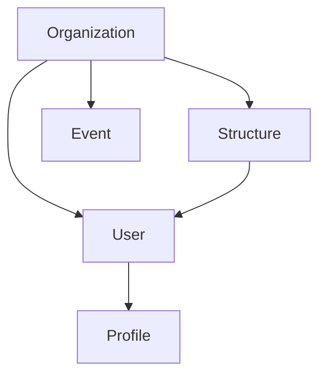

---
layout:
  title:
    visible: true
  description:
    visible: false
  tableOfContents:
    visible: true
  outline:
    visible: true
  pagination:
    visible: true
---

# 👷‍♀️ User 🔵

## Definition

There is 2 types of users (but no functional difference)

* **User:** Cf. [Glossary](../../../../../../Perso/registry-documentation/glossary.md)
* **Service account:** Cf. [Glossary](../../../../../../Perso/registry-documentation/glossary.md)

### Properties

* **OIDC identifier**\
  The OIDC identifier, is the link to identify user from Keycloak or other organization identity provider.
* **First name**\
  Used for Participant and User. Value is updated on User login.
* **Last name**\
  Used for Participant and User. Value is updated on User login.
* **Email**\
  Used for Participant and User. Value is updated on User login.
* **Birthday**\
  Used for Participant and User. Value is updated on User login.
* **Role**\
  Used for User and Service Account. Value define the user global application role.
* **Last login date and time**\
  To facilitate the User management, we keep last login date and time to easily identify non active ones.
* **Theme**\
  Registry should be available is light and dark mode, we store the User preference.
* **Driver license**\
  Used for Participant. If the participant want to drive vehicle. An Organization can require a driver contract. The
  driver license is
  the path of the (encoded) contract. This contract may include the user's driver license copy.
* **Opt-in consent**\
  That a list of consent related to opt-in
* **Purged**\
  That value indicated if the User has been impersonate or not.
* **Hidden**\
  A User, Participant, Guest or Service account can be block and unblock.

## Role's Scope

## Features

### As a User

* I can consult the entire Users (with search, sort, etc.).
* I can block (hide) a User.
* I can unblock (restore) a User.
* I can delete a User.
* I can ask to impersonate myself (right to be forgotten).
* I can impersonate a User.

### As an Organization

* I can listen new Users in a TOPIC 🟣
* I can listen deleted Users in a TOPIC 🟣
* I can listen impersonated Users in a TOPIC 🟣

## Constraints

### As a User

* I cannot hide and restore myself.
* I cannot hide and restore service account.
* I can sort Users by last name.
* I can search Users by first name, last name, email.
* I can update other Users role (other field is not updatable).
* I can update my theme, driver license and opt-in consent (other field is not updatable).
* I cannot login if my User is blocked.

> If you delete a User, it will delete it and all related information in the database but he still can login. If you
> want to prevent a
> User connection, you should block him.

### As an Organization

* The new Users are not created in the Registry application. A User is considered as a new one when Registry has not
  past connection
  for him.
* The deleted Users are delete in Registry by not in the authentication provider.
