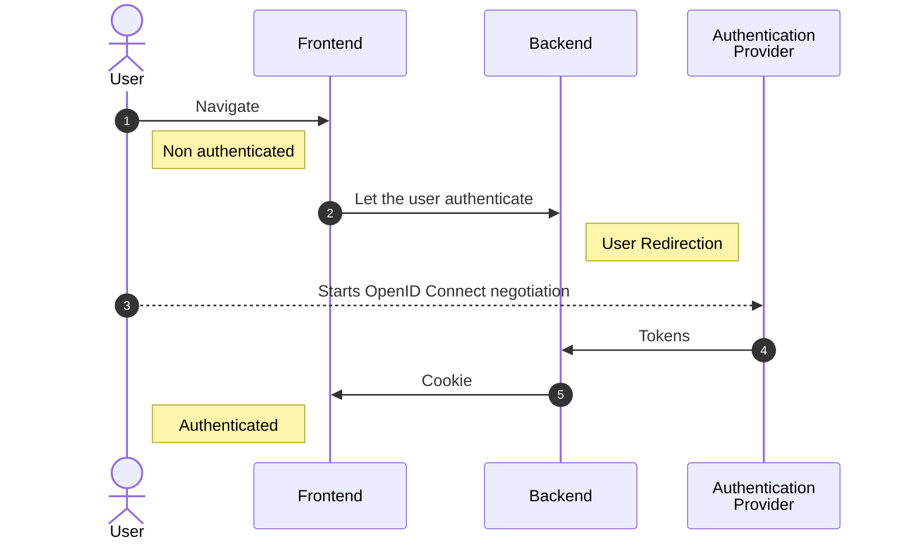
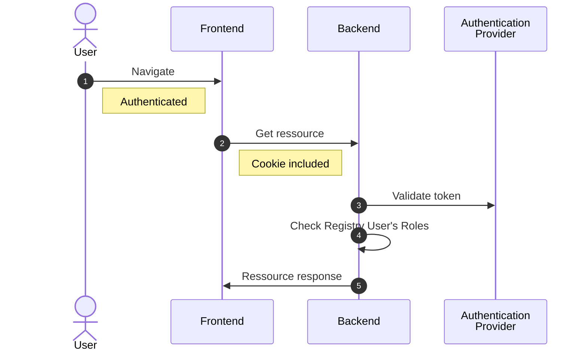

---
layout:
  title:
    visible: true
  description:
    visible: false
  tableOfContents:
    visible: true
  outline:
    visible: true
  pagination:
    visible: true
---

# 🔐 Authentication

Authentication management is delegated to the Organization authentication system, which must be configured when a new
Organization is created.

## Flow

### Authenticate


Authentication flow explanation source


### Get ressource

