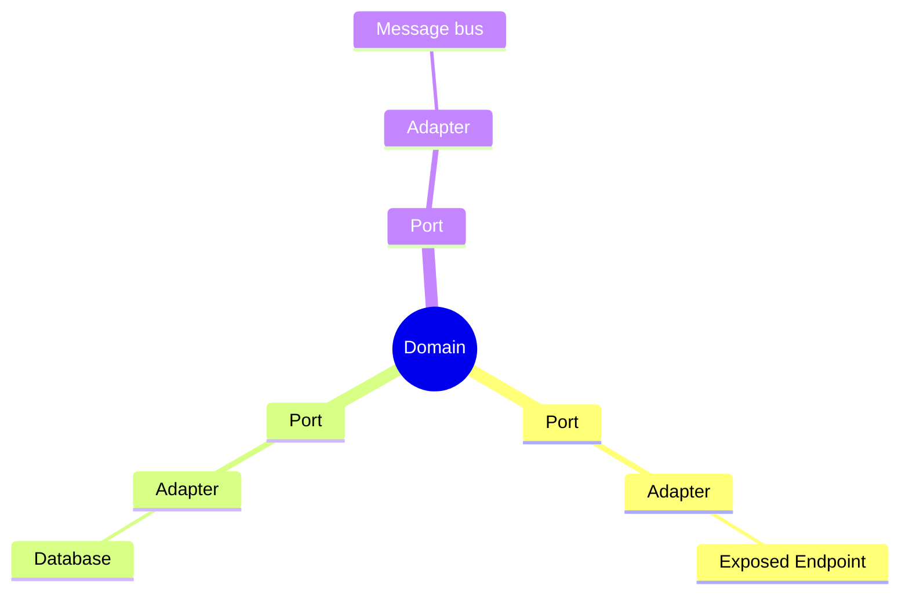

---
layout:
  title:
    visible: true
  description:
    visible: false
  tableOfContents:
    visible: true
  outline:
    visible: true
  pagination:
    visible: true
---

# 🖥️ Backend

## Technologies

In addition to functional needs, this project exists to help me progress technically, and as part of this, it must use technology that interests me, although there's always better. Beyond that, let's keep in mind that this is a project developed in my spare time, and I don't have the time to relearn everything about other technologies.

The backend will based on

* Spring boot (Reactive)
* Kotlin
* Gradle

## Architecture Hexagonal

### Definition

Hexagonal architecture, also known as port and adapter architecture, is a style of software architecture that aims to create flexible, scalable software systems. It was introduced by Alistair Cockburn, an expert in software development methodologies.

The main idea behind hexagonal architecture is to separate the core business of the application (the domain) from implementation details such as frameworks, databases, user interfaces and so on. It uses a hexagon-shaped structure to represent the different parts of the system.

{% embed url="https://medium.com/@faroukymedia/de-la-th%C3%A9orie-%C3%A0-la-pratique-spring-boot-architecture-hexagonale-et-ddd-pour-des-applications-f1110d83bced" %}
Hexagonal defintion source


### My Opinion

This architecture is a good thing for long time evolution. But there is some inconvenient:

* Many file
* Reading complexity
* Etc.

> Keep in mind that we don't use this architecture because people use it, but because it suits our needs.
