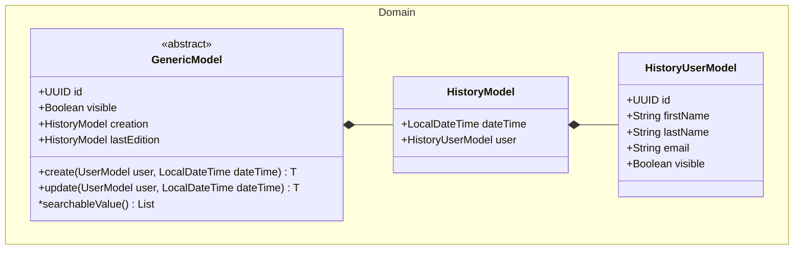
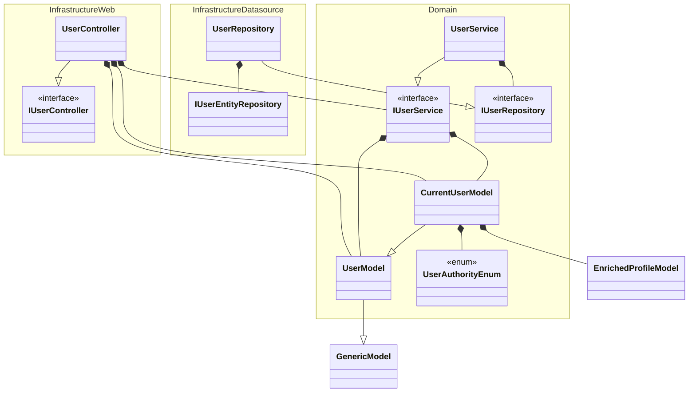

---
layout:
  title:
    visible: true
  description:
    visible: false
  tableOfContents:
    visible: true
  outline:
    visible: true
  pagination:
    visible: true
---

# 🔵 Lot 1 (MVP)

## Organization

Is Registry take a commercial way, it could be interessant to create mono instance to reduce exploitation cost. But for the moment, we will create multi-instance backend but create an organization configuration level To make a futur evolution easier.

An example of organization configuration:

```yaml
registry:
  information:
    name: "Registry"
    description: "This application allows virtual registry management. This is a backend which one is called by the frontend."
  support:
    firstName: Luc
    lastName: AUCOIN
    email: luc.aucoin1998@gmail.com
  security:
    auth:
      keycloak-url: ${external.security.auth.base-url}/realms/${external.security.auth.realm}/protocol/openid-connect
      auth-url: ${external.security.auth.keycloak-url}/auth
      token-url: ${external.security.auth.keycloak-url}/token
      certs-url: ${external.security.auth.keycloak-url}/certs
      claim-keys:
        user-id: "sub"
        email: "email"
        first-name: "given_name"
        last-name: "family_name"
    role-definition:
      user-authority:
        BUSINESS_ROLE:
          - […] Permission
      event-authority:
        BUSINESS_EVENT_ROLE:
          - […] Permission
      registration-authority:
        BUSINESS_REGISTRATION_ROLE:
          - […] Permission
  feature:
    option:
      available:
        - […] Option
    movement:
      draft:
        suggestion-threshold: 30 # in minute
```

## Framework

The following part describe the frame to implement features.



Refer to the section below for the other functionals objects implementation of the MVP.

## User



## Profile


## Event


## Participant

